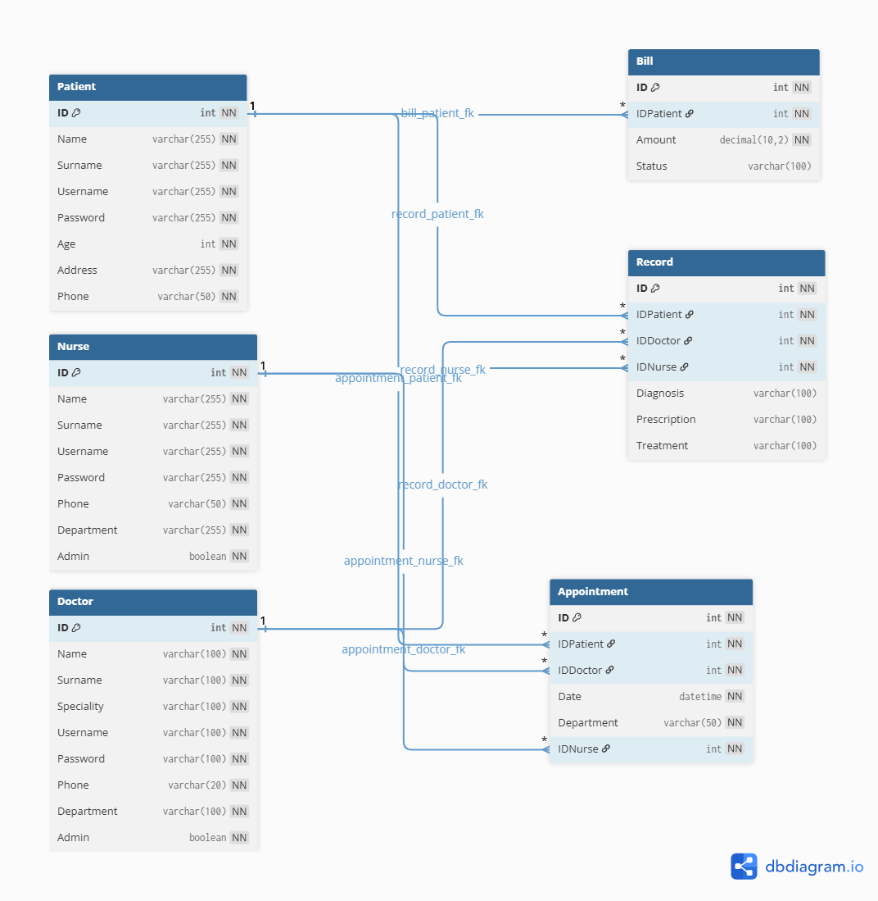

# 🏥 Hospital Project - Documentazione Tecnica

## 📖 Introduzione
Hospital Project è un'applicazione web basata su **ASP.NET Core MVC** per la gestione di un sistema ospedaliero.  
Il sistema supporta operazioni amministrative e cliniche come gestione pazienti, appuntamenti, fatturazione e cartelle cliniche elettroniche.

## 🎯 Obiettivi
- 👩‍⚕️ Gestione dati di pazienti, medici, infermieri e reparti  
- 🗓️ Pianificazione e tracciamento appuntamenti  
- 💳 Gestione delle fatturazioni e dei pagamenti  
- 📝 Gestione cartelle cliniche elettroniche  
- 🔐 Sistema di autenticazione e ruoli con JWT e Claims  

## ⚙️ Installazione ed esecuzione
1. Clonare il repository:
   ```bash
   git clone https://github.com/tuo-username/Hospital-RCM.git```
2. Configurare SQL Server con il dump in Database/Hospital.zip

3. Aggiornare appsettings.json con le credenziali del database

4. Aprire i progetti in Visual Studio:  
    - `ServerAPI/HospitalAPI.sln` per la parte API  
    - `Mvc/Hospital.sln` per la parte frontend MVC

5. Compilare ed eseguire i progetti da Visual Studio o CLI .NET

6. Accedere via browser a https://localhost:5001

## 🏗️ Architettura del sistema
- **Controller**: Appointment, Bill, Doctor, Nurse, Patient, Record, User, Home  
- **Models**: entità e ViewModel  
- **Helpers**: gestione token, ruoli, dipartimenti, specialità  
- **Configurazione**: `Program.cs`, `appsettings.json`

## 🗄️ Database
Il progetto utilizza **SQL Server** come database principale.  
Nella cartella `Database/` troverai `Hospital.zip` contenente **schema** e **dati iniziali**.

Ecco lo **schema visivo** del database:



## 🛠️ Tecnologie utilizzate
- C# .NET  
- ASP.NET Core MVC  
- Microsoft SQL Server  
- Visual Studio  
- Git & GitHub  

## 🚀 Funzionalità principali
- 🔐 Registrazione e login con gestione ruoli (JWT + Claims)  
- 👥 CRUD pazienti, medici, infermieri  
- 📅 Gestione appuntamenti  
- 💰 Gestione fatturazione  
- 📝 Cartelle cliniche e record medici  
- 🎨 UI interattiva per una migliore user experience  

## 🔮 Sviluppi futuri

- Integrazione con sistemi esterni

- Adozione standard HL7/FHIR

- Miglioramento interfaccia con framework moderni (React, Angular)

- Dashboard e reportistica avanzata